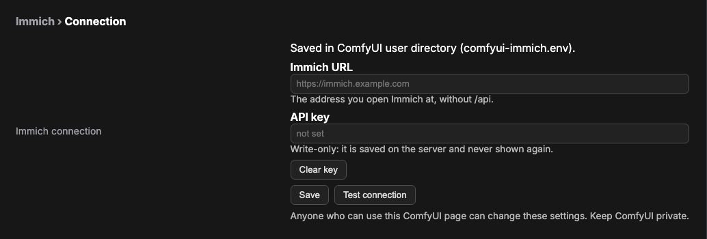

# comfyui-immich

Custom nodes for [ComfyUI](https://github.com/comfyanonymous/ComfyUI) that integrate with [Immich](https://immich.app) — the self-hosted photo management platform.

## Features

- **Save to Immich** — Upload generated images directly to your Immich server
- Full workflow and prompt metadata embedded in PNG (drag-drop back into ComfyUI to reproduce)
- ComfyUI-viewable local preview written before upload, so a down Immich
  does not eat the render (the UI and API clients both read this file)
- Optional character label, album assignment, and description tagging
- Immich v3-compatible upload payloads
- Per-image error handling — one failure doesn't crash the batch
- Zero extra dependencies — uses only packages already in ComfyUI (PIL, numpy, torch)

## Install

**From ComfyUI-Manager:** open **Custom Nodes Manager**, search for **Save to Immich**, install, and restart ComfyUI. It is published on the [Comfy Registry](https://registry.comfy.org/nodes/comfyui-immich) as `comfyui-immich`.

**With comfy-cli:** `comfy node install comfyui-immich`

**Manually:** clone into your ComfyUI `custom_nodes` directory and restart ComfyUI:

```bash
cd /path/to/ComfyUI/custom_nodes
git clone https://github.com/sourceblender/comfyui-immich.git
```

The node appears under **image/immich** in the node menu. It needs no packages beyond what ComfyUI already ships.

## Configure

**In ComfyUI (recommended).** Open **Settings** (the gear, bottom left) → **Immich**, then fill in:

- **Immich URL**: the address you open Immich at, **without `/api`** (for example `https://photos.example.com`).
- **API key**: **write-only**. It is saved on the server and never shown again; type a new one to replace it, or **Clear key**.

Click **Save**, then **Test connection**, which checks only the saved settings. Changing the URL asks for confirmation and **clears the saved key unless you enter a new one with it**, so your key is never sent to a server you did not choose. Settings are stored in `<ComfyUI user directory>/comfyui-immich.env`, so they survive updating or reinstalling the node.



> **Anyone who can use your ComfyUI page can change these settings.** ComfyUI has no login by default, so keep it private. The key is never sent back to the browser.

- **Behind an HTTPS reverse proxy?** The panel only accepts saves from ComfyUI's own origin. Set `IMMICH_ALLOWED_ORIGINS` (comma-separated, exact origins such as `https://comfy.example.com`) in the environment or a `.env` file; otherwise saving is refused with `cross_origin`.
- **URL set by an environment variable?** The panel says so and refuses to change it (`url_shadowed`), because the variable would win anyway. Change it where it is set.
- **Key set in the environment or the node folder's `.env`?** The panel won't change the URL or clear the key (`key_outside_panel`), so a key can never follow a new URL behind your back. Change both where the key lives.

**Alternative: environment variables or a `.env` file.** These still work. `IMMICH_URL` and `IMMICH_API_KEY` are read from the first place that has them:

1. **Environment variables** of the process running ComfyUI (these override the panel).
2. **`<ComfyUI user directory>/comfyui-immich.env`**: what the panel writes.
3. **`.env` in this node's folder**: copy `.env.example` to `.env`:

```env
IMMICH_URL=https://your-immich-instance.com
IMMICH_API_KEY=your-api-key-here
```

The node folder's `.env` is gitignored, but a reinstall that replaces the folder (for example through ComfyUI-Manager) does **not** keep it. Prefer the panel or environment variables.

### Status from the node

Right-click the **Save to Immich** node:

- **Immich: connection status** shows the server URL, whether an API key is set (never the key itself), and where each came from.
- **Immich: test connection** makes one request to the saved server with the saved key and tells you whether it works (for example "key rejected" or "server unreachable").

### Getting an Immich API key

1. Open your Immich instance in a browser.
2. Go to **Account Settings** (click your avatar).
3. Scroll to **API Keys** → **New API Key**.
4. Give it a name (for example "ComfyUI") and create it.
5. Paste the key into **Settings → Immich → API key** and click **Save**.

## Try the example

Open `examples/immich-save-example-api.json` in ComfyUI (**Workflow → Open**, or drag the file onto the canvas). It is two nodes: **Load Image** feeding **Save to Immich**. It uses `example.png`, which ComfyUI ships in its `input` folder, so no image model is needed. Configure the connection above, then **Queue**. The image appears in Immich with the description "comfyui-immich example upload", and the node's receipt shows in the queue history.

## Nodes

### Save to Immich

**Category:** `image/immich`

An output node that uploads images to Immich at the end of a workflow.

#### Inputs

| Input | Type | Required | Default | Description |
|-------|------|----------|---------|-------------|
| images | IMAGE | Yes | — | Image tensor from the pipeline |
| character | STRING | No | `""` | Who this render is of. Prefixed onto the Immich description as `Character: …`. Automation that drives ComfyUI through its API can fill it; in the UI, type it by hand. Not an Immich people/face tag. |
| description | STRING | No | `""` | Description visible in Immich UI. Empty means auto-build from the graph (character, checkpoint/UNET, sampler, seed, prompt). |
| album_id | STRING | No | `""` | Immich album UUID to add the image to |
| filename_prefix | STRING | No | `"ComfyUI"` | Prefix for the uploaded filename. May include subfolders (`portraits/nova`) within ComfyUI's output directory; absolute paths, `..`, and escaping symlinks are refused. |

#### Hidden Inputs (automatic)

| Input | Description |
|-------|-------------|
| prompt | Full node/prompt data — embedded in PNG metadata |
| extra_pnginfo | Workflow JSON — embedded in PNG metadata |

#### What Gets Saved

Each uploaded image includes:

- **PNG metadata**: Full ComfyUI workflow + prompt data (same format as the built-in SaveImage node). You can drag the image back into ComfyUI to load the exact workflow that created it.
- **ComfyUI preview**: A local output copy written *before* the upload. The UI and API clients download this file from history even if Immich is unreachable.
- **Immich description**: The `description` field if you filled it, otherwise an auto-built caption from the graph. A filled `character` is always prefixed.
- **Album placement**: If `album_id` is provided, the image is added to that album immediately after upload.

#### Usage

Wire it as a terminal node — connect the image output from your VAE Decode, Detailer, or any image-producing node:

```
KSampler → VAE Decode → Save to Immich
```

Use it **instead of** SaveImage when you want one copy. Running both publishes
the same picture twice (re-encoded) because each output node writes its own
history entry, so anything reading the history sees two files.

The node works the same whether a graph is run by hand or queued by a script
through ComfyUI's API. A script typically fills only `character` (and
optionally `description` / `album_id`). A graph with those fields left blank
still archives: the node reads the prompt, checkpoint or UNET, sampler, and
seed itself.

## Archive receipts and recovery

Local preview delivery and Immich archiving have separate outcomes. History
contains `ui.images` for previews and `ui.archive` for per-image upload,
description, and album results. Each archive receipt includes an asset ID
when available and stage-specific errors. A preview alone does not confirm
archiving. Missing archive configuration also preserves the local preview.

The two directions are independent: a rejected `filename_prefix` or an
unwritable output directory is reported as a `preview` stage error while the
image still reaches Immich. One failed image never cancels the rest of the
batch, so receipts for images already uploaded are never lost.

The node prints one summary line per batch, so a working archive is never
silent. Failures name the file — that name is the argument `retry_archive`
takes — and a retry hint appears whenever the local PNG still exists.

Receipt values worth knowing:

| Field | Value | Meaning |
|-------|-------|---------|
| `upload` | `ok` / `reused` / `failed` | `reused` means an existing asset ID was supplied and nothing was uploaded |
| `description` | `ok` / `failed` / `not_requested` / `not_attempted` | `not_attempted` means an earlier stage failed first |
| `album` | `ok` / `unconfirmed` / `failed` / `not_requested` / `not_attempted` | `unconfirmed` means Immich returned success with no per-asset body to verify |

Filename prefixes may include subfolders within ComfyUI's output directory.
Absolute paths, parent components, and symlinks escaping that directory are
refused. History reports the correct basename and subfolder for retrieval.

Retry an existing PNG without another GPU render from this node's directory:

```bash
/path/to/ComfyUI/.venv/bin/python -m immich_nodes.retry_archive /path/to/original.png
```

This uploads the unchanged PNG and reads its embedded archive description and
album. If upload already succeeded, add `--asset-id <id>` to retry only metadata.
Results are JSON; a non-zero exit code indicates at least one stage errored
(an `errors` entry in the report). `unconfirmed` album states are not
treated as errors and produce exit code 0 — they signal "check whether a
proxy is stripping the response body" rather than a failed archive.

Recovery needs the original file. A PNG with no embedded graph, an unreadable
one, or one holding several archive nodes is refused with a message on stderr
and exit code 1 rather than archiving with no metadata.

## Updating

Update from ComfyUI-Manager, or with `comfy node update comfyui-immich`, or `git pull` in the node folder for a manual install. Settings saved from the panel live in the ComfyUI user directory, so updates and reinstalls keep them.

## Privacy and security

- **Your workflow travels with every image.** Each uploaded PNG embeds the
  full ComfyUI workflow and prompt, exactly like the built-in SaveImage node.
  Anyone who can download the original from Immich (for example through a
  shared album or link) can read your prompts and reload your graph.
- **The API key is never stored in a workflow.** It lives in the settings
  file, an environment variable or `.env`, never in a node input, so it does
  not end up in saved workflows or in PNG metadata. The settings panel never
  sends it back to the browser.
- **Your key does not follow a redirect.** The node refuses any redirect from
  Immich instead of following it, so the key is never forwarded to another
  host. Save the final address as the URL.
- **Use a dedicated key.** Create a key just for ComfyUI so you can revoke it
  on its own. If your Immich version lets you restrict a key, it needs to
  upload assets, read and update them (for the description), and add them to
  albums.
- **Network scope.** The node sends requests only to your `IMMICH_URL`
  (through your system proxy, if `HTTP(S)_PROXY` is set), and its timeouts
  apply only to its own requests. It does not change networking
  for other nodes.

## Compatibility

- Python 3.10 or newer (the same as ComfyUI)
- Immich with the v3 upload API
- No dependencies beyond what ComfyUI already ships (Pillow, NumPy)

## Troubleshooting

| Symptom | Likely cause |
|---|---|
| `IMMICH_URL not set` / `IMMICH_API_KEY not set` | Nothing is configured. Open **Settings → Immich**, save the URL and key, and click **Test connection**. |
| Saving in Settings says `cross_origin` | You reach ComfyUI through a reverse proxy. Set `IMMICH_ALLOWED_ORIGINS` (see *Configure*). |
| Saving in Settings says `url_shadowed` or `key_outside_panel` | The URL or key is set by an environment variable or the node folder's `.env`. Change it there. |
| Upload fails with a redirect error | Immich (or a proxy) redirected the request. Save the final address as the URL, for example `https://` instead of `http://`. |
| Upload fails with HTTP 401 or 403 | The key is wrong, revoked, or missing a permission (see *Privacy and security*). |
| Upload fails with a connection or timeout error | The Immich URL is unreachable from the machine running ComfyUI. Open it in a browser **on that machine**. The local preview is still saved. |
| `album` receipt is `unconfirmed` | Immich returned success without a per-asset body, often because a proxy strips it. Check the album in Immich. |
| Image in Immich but no description | Check the `description` stage in the receipt, then use `retry_archive` with `--asset-id` to retry only the metadata. |

## Tests

The offline suite runs without ComfyUI or a live Immich. With [uv](https://docs.astral.sh/uv/):

```sh
uv run --extra dev pytest
```

Or with pip: `pip install -e ".[dev]"`, then `python -m pytest`. The settings-route tests serve the real handlers over HTTP and need `aiohttp` (part of the dev extra, and already provided by ComfyUI).

## Releasing (maintainers)

Merging to `main` never publishes. To release, bump `[project].version` in `pyproject.toml` in a pull request, then publish a GitHub release tagged `v<version>` on `main`. The release workflow runs the full CI, refuses a tag that does not match the version, and publishes to the Comfy Registry. A pre-release does not publish.

## License

MIT
